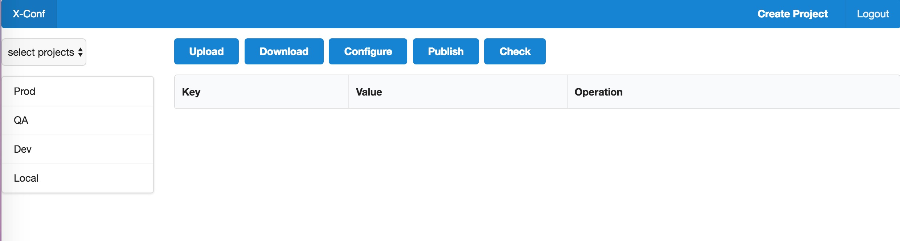
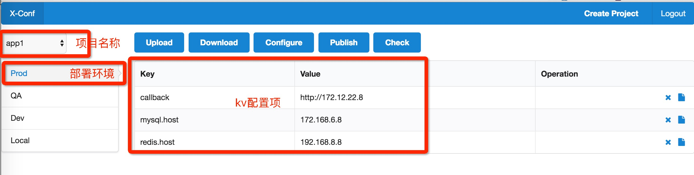
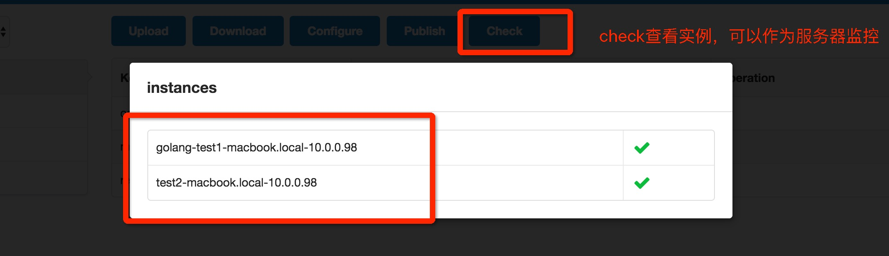

# x-conf
介绍：x-conf是一个基于etcd分布式配置平台，由3部分组成，client(支持多语言)、web(添加、更新、发布配置，也可实现服务监听功能)




## Task
* 支持多环境（prod dev qa local）、多项目、多语言（注：目前以支持golang和java，近期完成ruby和pytho）
* 区分普通用户和管理员，普通用户只能操作（查看、更新、删除）dev,qa,local环境的配置，管理员可以操作所有环境的配置。(注：目前web只有一个admin用户，马上完成用户管理)
* 详细的操作日志记录，便于回放每个用户的每个操作
* 持久化配置，预防宕机（注：依靠etcd的持久化功能，不用依靠数据库等持久化，简化配置和运维）
* 提供通用配置项，不同的项目可共享的配置（注：有share项目，所有项目共享配置）
* 能监控有多少个实例在共享某个配置
* 支持文件批量导入，也支持下载

## 安装
### 1、安装、配置、启动etcd [请参考](https://github.com/coreos/etcd)
### 2、安装web
#### 1）、直接下载二进制启动服务[unix*下载地址](https://github.com/medlinker/x-conf/releases/download/1.0/x-conf_linux_release_1.0.0)  [mac下载地址](https://github.com/medlinker/x-conf/releases/download/1.0/x-conf_osx_release_1.0.0)

运行：./x-conf_osx_release_1.0.0 -conf x-conf.onf(说明 -conf 指定配置文件路径)
x-conf.conf内容：
 
```
# 实例名称，用于监控（可选）
instanceName=test1
# 项目名（必填）
prjName=app1
# 环境（local dev qa prod 必填）
env=prod
# etcd集群地址，逗号分割（必填）
etcd_clinet_urls=http://127.0.0.1:2379
# web启动必填，客户端默认false
web=true
```

#### 2）、通过源码编译和运行（required go1.6+）

```
# clone项目
git clone git@github.com:medlinker/x-conf.git
# 进入web目录
cd web
# 编译或直接运行
go build 或
go run main.go -conf conf文件路径
```

### 3、导入客户端
#### 1）、goclient
`go get github.com/medlinker/x-conf/client/goclient`
使用

```
package main

import (
	"fmt"
	"github.com/medlinker/x-conf/client/goclient"
)

func main() {

	// 获取某个key
	fmt.Println(goclient.GetLM("redis.host"))

	goclient.Watching(func() {
		fmt.Println("当前项目环境的配置新发布！")
	})
	goclient.WatchingShare(func() {
		fmt.Println("共享配置有新发布!")
	})

	ch := make(chan int, 1)
	<-ch
}
```

*注：将x-conf.conf放在项目目录中或指定位置-conf*

#### 2）、javaclient
#####（1）、整准备将稳定版本上传中央仓库，通过maven和gradle依赖（上传后会发布maven和gradle依赖配置）
#####（2）、直接下载jar包，添加进自己的私服或导入项目中 [下载地址](https://github.com/medlinker/x-conf/releases/download/1.0/java-clinet-1.0.0-RELEASE.jar)

```
<dependency>
	<groupId>com.medlinker.xconf</groupId>
	<artifactId>java-clinet</artifactId>
	<version>1.0.0-RELEASE</version>
</dependency>
```


```
package com.sosop.test;

import com.medlinker.xconf.Client;

public class XConfClientTest {
    public static void main(String[] args) {
        Client c = new Client();
        
        // 获取配置
        System.out.println(c.get("mysql.host"));
        
        // 监听当前项目环境配置的发布
        c.watching(p -> {
            System.out.println("当前项目发布配置！");
        });
        c.watchingShare(p -> {
            System.out.println("共享配置发布！");
        });
    }
}
```
*注：将x-conf.conf放在项目目录中*  

##### 3)、通过源码编译、打包、安装、发布（maven或gradle）


